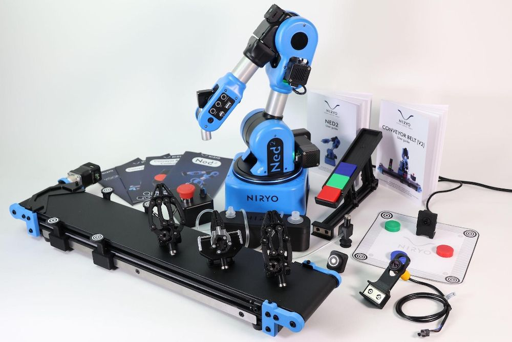

# Niryo Robot — Conveyor Sorting & Vision Pick


---

## What is this?

This script automates a full pick-and-place sorting cycle on a Niryo robotic arm. The robot loads parts onto a conveyor belt, waits for them to reach a detection point using an infrared sensor, identifies each part by shape and color using computer vision, and sorts them into the correct drop zones. When no more parts are detected in the vision workspace, it performs two final picks and drops them onto a ramp.

---

<!-- Add a photo of the full station here (robot + conveyor + drop zones) -->


---

## How it works

The mission runs in four sequential phases:

Phase 1 — Loading
The robot picks two parts one by one from a fixed pick pose and places them onto the conveyor belt. The conveyor starts moving after the first part is deposited so the two parts travel with spacing between them.

Phase 2 — Conveyor sorting
For each part on the belt, the robot waits at a standby pose. When the infrared sensor detects a part passing, the conveyor stops. The robot moves to the camera pose above the conveyor workspace and uses vision to identify the part by shape (square or circle) and color (red, blue, green). It then picks and drops the part into the correct zone.

Phase 3 — Bundle workspace sorting
The robot scans a second workspace where parts can be placed manually. It keeps picking and sorting until no more parts are detected.

Phase 4 — Final ramp drop
Once the bundle workspace is empty, the robot performs two final picks from two defined poses and deposits both parts on a ramp, then returns to the wait pose.

## Project structure

```
niryo-sorting/
│
├── main.py          
├── config.py        
└── README.md
```

---

## Hardware

- Niryo One or Ned robotic arm
- Conveyor belt (Niryo compatible, ID_1)
- Infrared sensor on DI5
- Vacuum pump end effector
- Camera mounted on the robot for vision pick
- Three drop zones for squares (red, blue, green)
- One grid palette for circles (2 columns, 4 rows)
- One final ramp drop zone


## Setup

Install the Niryo Python SDK:

```bash
pip install pyniryo
```

Edit the configuration at the top of main.py to match your station:

```python
ROBOT_IP       = "10.10.10.10"       
CONVEYOR_ID    = ConveyorID.ID_1
CONVEYOR_SPEED = 30
IR_PIN         = PinID.DI5

WORKSPACE_CONVEYOR = "Convoyeur_final"
WORKSPACE_BUNDLE   = "vision_set_final"
```

Run the script:

```bash
python main.py
```

Press Ctrl+C to stop at any time. The robot will release the vacuum and close the connection cleanly.

---

## Poses

All poses are defined as six-value lists: [x, y, z, roll, pitch, yaw] in meters and radians.

| Name | Role |
|---|---|
| PICK_POSE | Source pick zone for conveyor loading |
| PLACE_POSE | Drop point at the start of the conveyor |
| WAIT_POSE | Safe standby position between operations |
| CAMERA_CONV_POSE | Camera position above the conveyor workspace |
| OBS_CAM_POSE | Camera position above the bundle workspace |
| DROP_SQUARE_RED/BLUE/GREEN | Drop zones for sorted square parts |
| DROP_CIRCLE_ORIGIN | Grid origin for circle part palette |
| FINAL_PICK_POSE_1/2 | Two pick zones for the final phase |
| FINAL_DROP_RAMP_POSE | Ramp drop destination for final picks |

---

## Vision targets

The robot searches for parts in the following order. The first match found is picked:

```
SQUARE / RED
SQUARE / BLUE
SQUARE / GREEN
CIRCLE / RED
CIRCLE / BLUE
CIRCLE / GREEN
```

Each target is tried up to VISION_RETRIES times (default: 2) before moving to the next.

---

## Key parameters

| Parameter | Default | Description |
|---|---|---|
| CONVEYOR_SPEED | 30 | Belt speed percentage |
| CONVEYOR_SPACING | 0.07 m | Spacing between two parts on the belt |
| SAFE_Z | 0.18 m | Safe height for transit moves |
| Z_OFFSET_PICK | 0.08 m | Approach height above pick pose |
| Z_OFFSET_DROP | 0.04 m | Approach height above drop pose |
| IR_TIMEOUT_S | 15.0 s | Max wait time for IR trigger |
| ARM_SPEED | 100 | Max arm velocity percentage |
| CIRCLE_COLS / ROWS | 2 / 4 | Grid size for circle palette |

---

## Known limitations

- The poses are hardcoded for a specific physical setup and will need recalibration for a different station layout
- Vision reliability depends on lighting conditions and workspace calibration quality
- The script assumes exactly two parts are loaded per cycle; partial loads are handled with a warning but not retried

---

## What could be improved

- Load poses from an external config file or a small calibration tool
- Add a retry loop when the IR sensor times out instead of skipping the part
- Support variable batch sizes instead of a fixed BATCH_SIZE of 2
- Log sorting results to a file for traceability

---

## License

MIT — see LICENSE for details.
